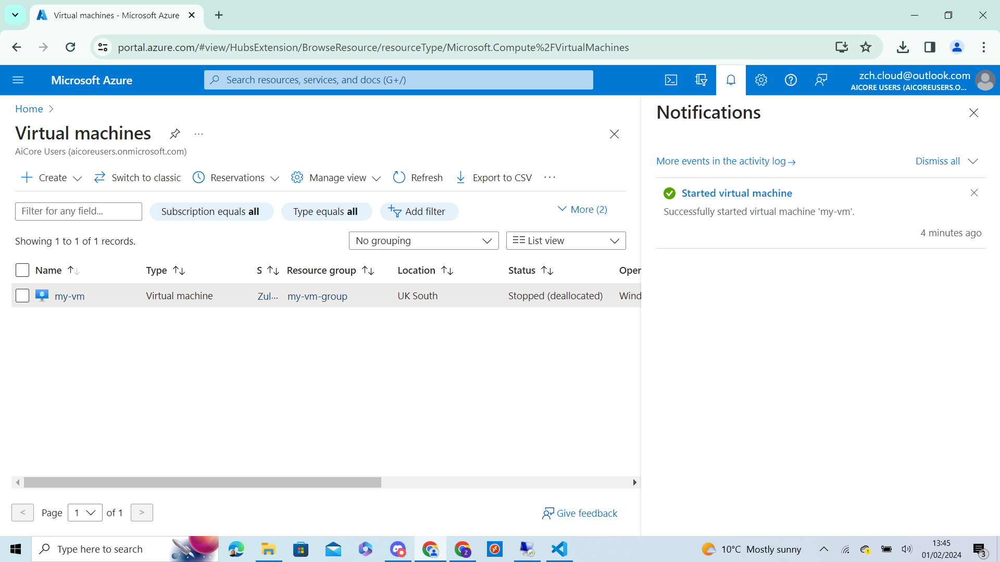

# Setting up production environment

## Set up a Windows Virtual Machine (VM)
The cornerstone of the production environment. This VM will emulate the functions of a Windows server, replicating the operations of an on-premise system within a company. Throughout the course of this project, the VM will act as a repository for the company's database. This setup effectively simulates a secure and dedicated data storage solution.

## Ensure the appropriate network settings and firewall rules to establish a connection to the VM using the RDP protocol.
Virtual machine deployed: 
